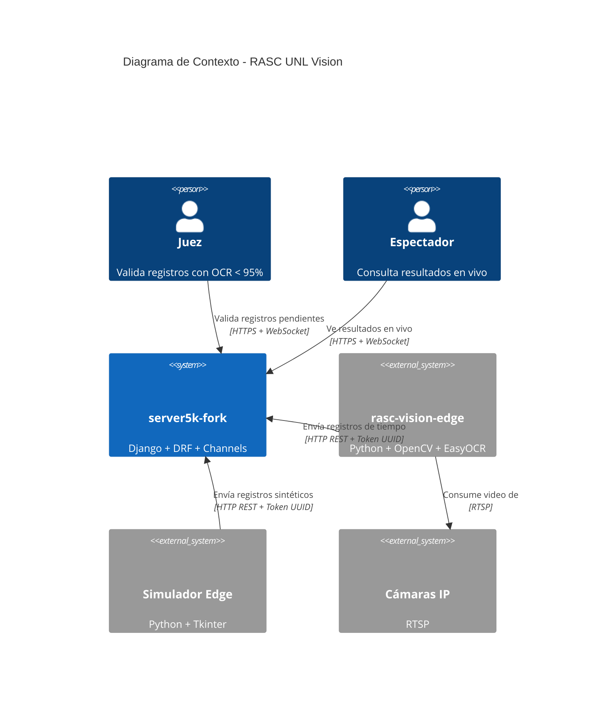
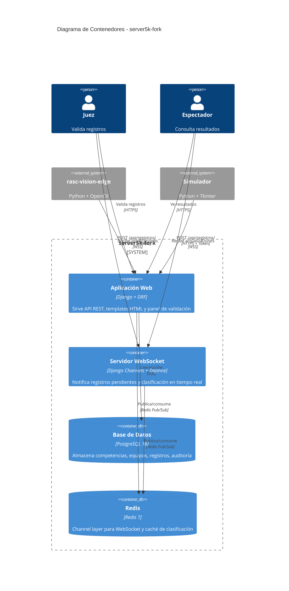
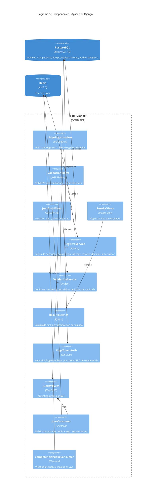
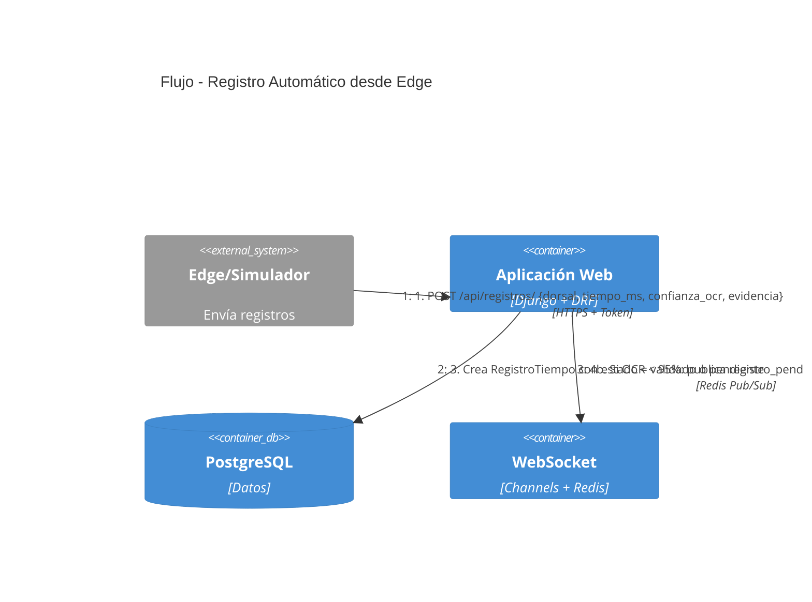
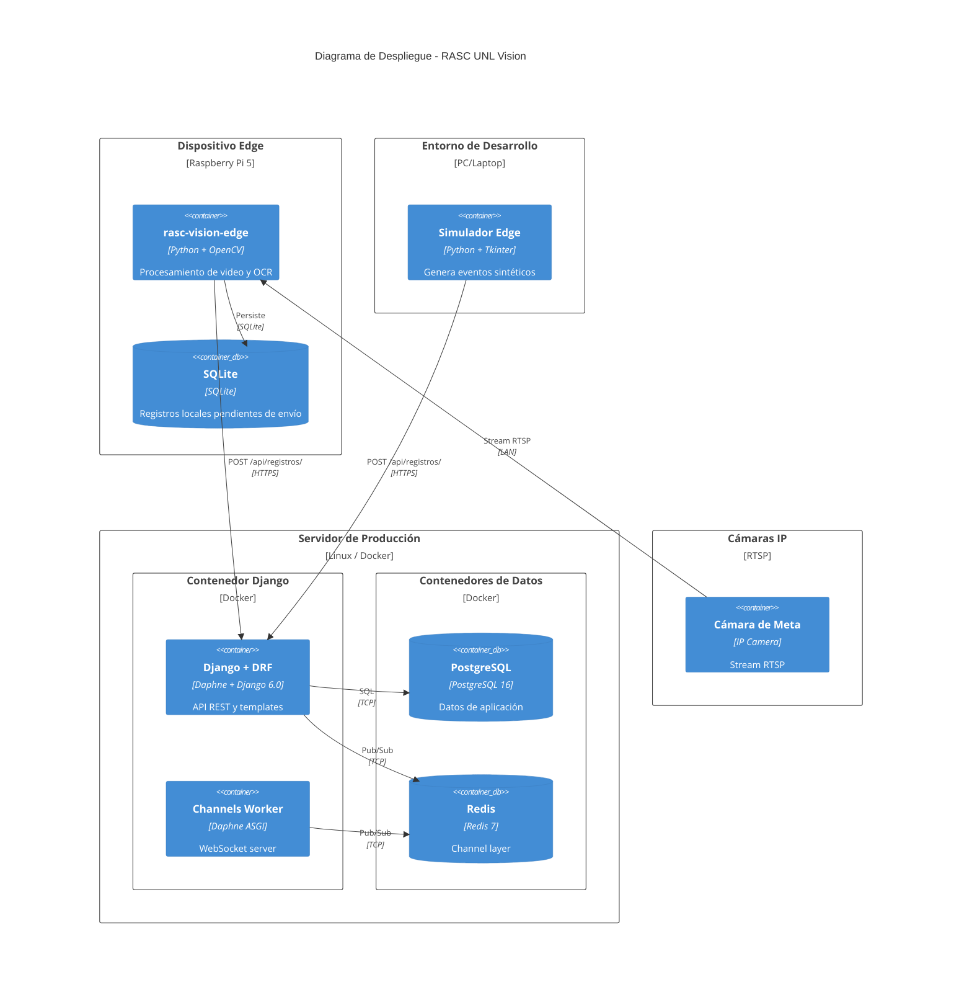
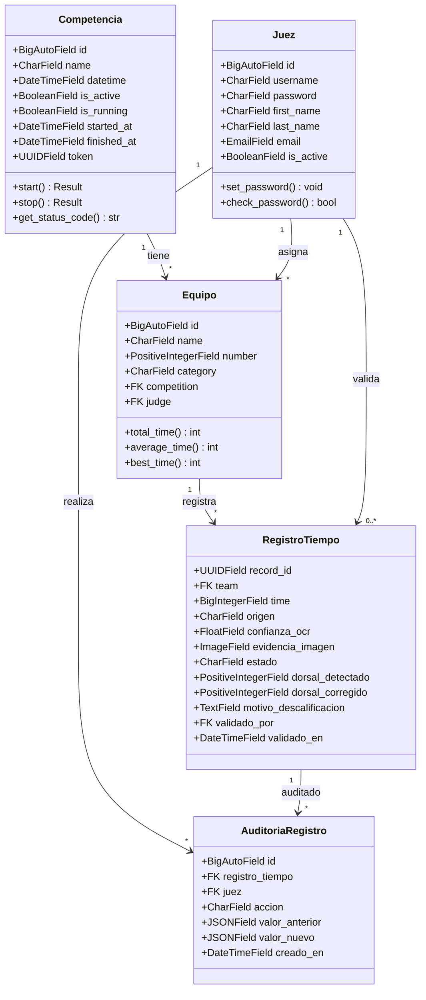

## Context

El proyecto `server5k-fork` es una aplicación Django monolítica con una única app (`app`) que gestiona competencias atléticas. Actualmente los jueces cronometristas registran manualmente 15 tiempos por equipo vía HTTP/WebSocket. El sistema ya cuenta con Django Channels (Redis + Daphne) para notificaciones en tiempo real, autenticación JWT personalizada sobre el modelo `Juez`, y PostgreSQL 16.

Se requiere eliminar el registro manual e incorporar un flujo automático donde dispositivos Edge (proyecto independiente `rasc-vision-edge`) detecten cruces de meta por visión artificial, identifiquen dorsales con OCR y envíen registros al backend. Los jueces pasan a validar solo los registros con confianza OCR < 95%.

## Goals / Non-Goals

**Goals:**
- Recibir registros automáticos desde Edge/simulador vía API REST con autenticación por token de competencia (UUID).
- Resolver dorsales contra equipos y validar automáticamente registros con OCR >= 95%.
- Notificar registros pendientes (OCR < 95%) a jueces vía WebSocket en tiempo real.
- Proveer panel de validación para jueces: confirmar, corregir dorsal, o descalificar con motivo.
- Registrar auditoría inmutable de toda acción manual de jueces.
- Actualizar clasificación en tiempo real en la página de resultados.

**Non-Goals:**
- No se implementa procesamiento de visión (OpenCV/EasyOCR) en este repositorio.
- No se implementa el simulador ni el Edge en este repositorio.
- No se migran datos históricos.
- No se modifica el flujo de inscripción de equipos ni la asignación juez-equipo.

## Decisions

### 1. Extender `RegistroTiempo` con campos de trazabilidad (no crear modelo nuevo)

**Alternativa**: Crear `RegistroTiempoEdge` como modelo separado.
**Decisión**: Extender el modelo existente porque un registro es conceptualmente lo mismo sin importar su origen, y evita duplicar lógica de cálculo de tiempos. Los nuevos campos son nullable para mantener compatibilidad con registros manuales existentes.

**Campos nuevos en `RegistroTiempo`:**
| Campo | Tipo | Descripción |
|---|---|---|
| `origen` | CharField(choices) | `automatico` / `manual` |
| `confianza_ocr` | FloatField(null=True) | 0-100, nullable para registros manuales antiguos |
| `evidencia_imagen` | ImageField(null=True) | Imagen JPEG del cruce; null si proviene del simulador |
| `estado` | CharField(choices) | `validado` / `pendiente` / `corregido` / `descalificado` |
| `dorsal_detectado` | PositiveIntegerField(null=True) | Dorsal leído por OCR |
| `dorsal_corregido` | PositiveIntegerField(null=True) | Dorsal corregido por juez |
| `motivo_descalificacion` | TextField(blank=True) | Obligatorio si estado = `descalificado` |
| `validado_por` | FK→Juez(null=True) | Juez que validó (null si automático) |
| `validado_en` | DateTimeField(null=True) | Timestamp de validación |

### 2. Autenticación Edge: token de competencia como API Key (no JWT)

**Alternativa**: Usar JWT para Edge también.
**Decisión**: Token UUID simple en header `Authorization: Token <uuid>` porque:
- El Edge/simulador no necesita sesiones, solo identificar la competencia.
- Token ya está asociado 1:1 con una competencia (generado al crearla).
- Más simple de implementar en dispositivos Edge con recursos limitados.
- El backend valida que el token corresponda a una competencia activa.

### 3. Endpoint único para Edge (`POST /api/registros/`) en lugar de por equipo

**Alternativa**: `POST /api/equipos/{id}/registros/` como el endpoint de jueces.
**Decisión**: Endpoint único porque el Edge no conoce IDs de equipo, solo dorsales. El backend resuelve el dorsal contra `Equipo.number` filtrado por la competencia del token.

### 4. Modelo `AuditoriaRegistro` separado para trazabilidad de acciones manuales

Cada acción de juez (confirmar, corregir, descalificar) genera un registro inmutable con: `juez`, `registro`, `accion`, `valor_anterior`, `valor_nuevo`, `timestamp`. No se usa django-simple-history para mantener dependencias mínimas y control total.

### 5. WebSocket: nuevo grupo `validacion_{competencia_id}` para jueces

El `JuezConsumer` existente se une al grupo de validación de su competencia para recibir notificaciones `registro_pendiente` en tiempo real. No se crea un consumer nuevo.

### 6. Jueces: registro público con modelo `User` de Django

**Alternativa**: Extender el modelo `Juez` existente con campos de `User`.
**Decisión**: Crear un modelo `Juez` vinculado 1:1 con `django.contrib.auth.models.User`. El modelo `Juez` existente se mantiene pero el nuevo flujo usa `User` + perfil `Juez`. Esto permite usar el sistema de autenticación estándar de Django (login, logout, sesiones) para el panel web de validación.

### 7. Registro de auditoría inmutable

Cada acción manual de juez queda registrada en `AuditoriaRegistro` con los campos: `registro_tiempo` (FK), `juez` (FK), `accion` (choices), `valor_anterior` (JSON), `valor_nuevo` (JSON), `creado_en` (DateTime). Esto garantiza trazabilidad completa incluso si el registro original es modificado posteriormente.

## Arquitectura C4

### Nivel 1: Contexto del Sistema

### Nivel 2: Contenedores

### Nivel 3: Componentes (Aplicación Django)

### Nivel 3: Diagrama Dinámico - Flujo de Registro Automático

### Diagrama de Despliegue

## Diagrama UML de Modelos

> Nota: La skill `uml` no se encuentra instalada. Se utilizan diagramas Mermaid `classDiagram` como equivalente.

## Risks / Trade-offs

- **[Riesgo] Latencia de WebSocket en conexiones inestables** → Mitigación: el panel de validación hace polling vía REST como fallback; el WebSocket es el canal primario pero no único.
- **[Riesgo] Colisión de dorsales** → Mitigación: `Equipo.number` es único dentro de una competencia (`unique_together`). Si el dorsal no coincide con ningún equipo, se rechaza con HTTP 400.
- **[Riesgo] Imágenes grandes en base64** → Mitigación: `evidencia_imagen` se almacena como `ImageField` en disco/S3, no en base64 en la DB. El endpoint acepta upload multipart.
- **[Trade-off] Un solo endpoint Edge** → Simplifica el API pero concentra la lógica de resolución dorsal→equipo en un solo punto. Aceptable dado que la competencia se resuelve del token.
- **[Trade-off] Auditoría en mismo esquema** → Tablas de auditoría crecen con cada acción. Se mitiga con índices por `registro_tiempo_id` y `creado_en` para consultas eficientes, y política de archivado futuro.

## Open Questions

- ¿El simulador debe poder generar eventos con confianza_ocr exactamente en el umbral (95%) para probar casos límite?
El simulador debe permitir poner generar eventos con confianza_ocr personalizada, para poder probar en desarrollo
- ¿La página de resultados debe mostrar solo registros validados o también pendientes? 
Solo reigstros ya validados para el ranking, y pendientes visibles solo para jueces.
